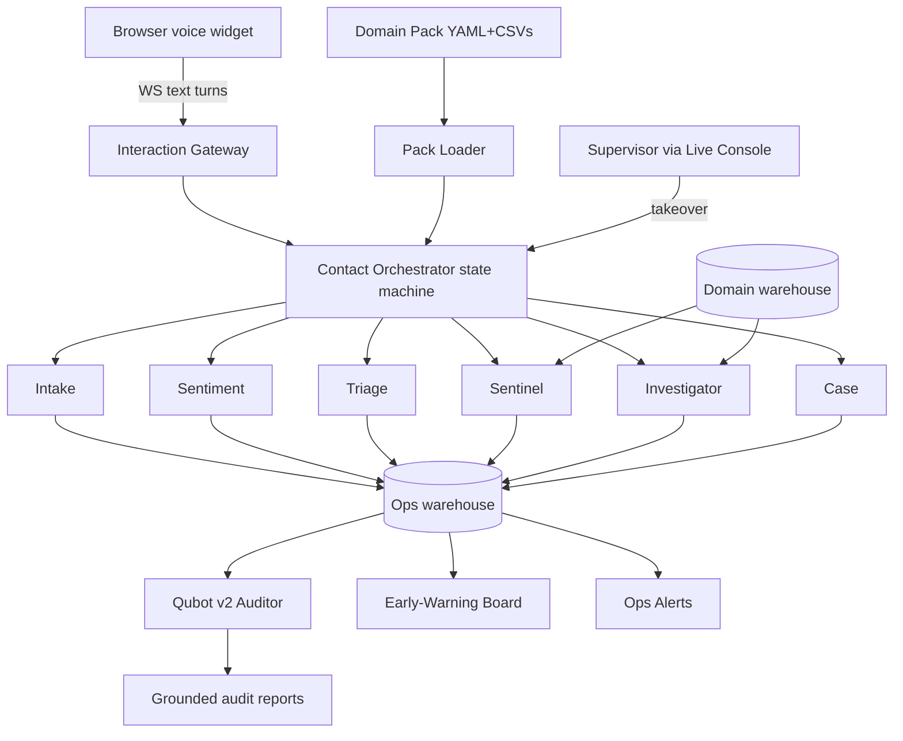

# Skew AI (skewai) — Domain-Agnostic Voice-of-Customer Intelligence Platform

> A company plugs in a **Domain Pack** (declarative YAML + CSVs) and instantly
> gets: an AI voice agent that answers customer contacts in the browser, a swarm
> of specialized agents that triages, checks known advisories, and matches each
> contact against the historical corpus while the customer is still talking,
> and **Qubot v2**, the auditor, which verifies every agent action stayed
> grounded in real data and publishes executive reports.

**Skew AI** (website brand: **skewai**) is the product name for this platform —
formerly referred to as Frontline / First Signal. The codebase still uses
`frontline` in API paths (`/api/frontline/*`) and env vars (`FRONTLINE_*`) for
compatibility.

Skew AI is the evolution of the v1 Qubot platform (NHTSA-only analytics
agent) into a **domain-as-data** system: the agents are generic engines and
everything domain-specific (entities, slot questions, safety rules, advisory
matching, severity logic, vocabulary) lives in a declarative pack.

## Why this is the innovative bet

- **Domain-as-data, not domain-as-code.** Adding an industry means writing
  YAML + CSVs, not Python. Two hand-authored packs (automotive + finance)
  prove the same agents work with zero code changes.
- **Pack Builder (MVP).** CSV → draft pack via CLI (`make pack-init
  SRC=file.csv PACK=my_pack`); human review of the generated mapping is
  still required before lint. No builder UI.
- **Audit-first agents.** Every agent action writes to a ledger before output
  is emitted, and Qubot deterministically re-verifies every cited evidence ID
  against the database.
- **Live early warning with teeth.** Incoming contacts re-score historical
  anomaly clusters in real time; enough related cases auto-open a named
  investigation; threshold crossings fire ops alerts.
- **Human-in-the-loop by design.** Per-turn frustration detection plus one-click
  supervisor takeover is the deployment story enterprises actually accept.

## What ships

Two real verticals (fixture-seeded demo packs below). Two additional packs
exist on disk (`consumer_cpsc`, `medical_maude`) for experimentation; they are
not fixture-seeded demo packs.

- **automotive_nhtsa** — NHTSA-style complaints + recalls. Ships with a small
  **fixture corpus (10 records, 2 advisories, 3 clusters)** so `make contact`
  and `make simulate` work out of the box offline.
- **finance_cfpb** — CFPB-style consumer complaints. Ships with the same
  **fixture scale (10 / 2 / 3)** for offline eval. Hand-authored pack, not
  generated by a builder.
- **_template** — scaffold for a third vertical (not gated in
  `make eval-frontline`; copy and fill gazetteers/data before using).

Fixture corpora are intentionally small for fast, deterministic, offline CI
(`make eval-frontline` runs both real packs in seconds, $0 LLM cost). Larger
warehouse ingest is a future ops concern; counts in this README always mean
the fixture scale above unless you replace the domain DuckDB files yourself.

## Architecture at a glance



**Voice approach (free, demo-instant):** the browser does STT (Web Speech API)
and TTS (`speechSynthesis`); the server only sees text over a WebSocket. Zero
audio infra, zero cost. A `ChannelAdapter` interface is defined from day one so
Twilio can be added later without touching agents.

**Design ethos (carried from v1):** no LangChain/agent frameworks — the
orchestrator is an explicit, testable state machine. **DB computes; agents
narrate from templates by default** (deterministic, $0). Optional LLM narration
lives in `src/ai/` and only runs when `FRONTLINE_LLM_ENABLED=1` **and** a
provider key is set (turn cap + daily spend enforced); otherwise the same
deterministic templates apply. Semantic similarity uses offline bag-of-hash
embeddings with ILIKE fallback. Hash-chained ledger: `make verify-chain ID=int_…`.
Scale corpus: `make ingest-scale N=10000`. Pack Builder MVP:
`make pack-init SRC=file.csv PACK=my_pack`.

## Quick start

### Option A — Docker Compose (pilot one-box)

Compose services are profile-gated. Use **open** for local pilot, or **hardened**
for the SOC 2 engineering baseline (requires secrets in `.env`).

```bash
# Open pilot (API key optional) — host port 8000
# optional: export FRONTLINE_API_KEY=change-me
docker compose --profile open up --build
# API + health:  http://127.0.0.1:8000/health
# Dashboard:     http://127.0.0.1:8000/ui/

# Hardened single-tenant (set FRONTLINE_API_KEY + SESSION_SECRET in .env)
# Host port 8001 by default so it never collides with open.
docker compose --profile hardened up --build
# API + health:  http://127.0.0.1:8001/health
```

**Deploy constraint:** the active-call registry is **in-process**
(`/health` reports `single_worker: true`). Run **one** uvicorn worker only —
do not scale replicas without sticky sessions / a shared registry.

**Pilot security (trust pass):** set `FRONTLINE_AUTH_REQUIRED=1` and a strong
`FRONTLINE_API_KEY` for any network-exposed pilot (fail-closed if the key is
missing). Dashboard WebSockets authenticate with a first-message auth frame
(not `?api_key=` in the URL). Connector webhooks reject private/metadata URLs.
This is **not** SOC2/HIPAA/multi-tenant identity. v3 experiments/deployments are
a **registry**, not live traffic routing.

### Option B — Local dev

```bash
# 1. Backend
python -m venv .venv
source .venv/bin/activate
pip install -r requirements.txt -c requirements-lock.txt
cp .env.example .env          # set DOMAIN_PACK=automotive_nhtsa; LLM off unless FRONTLINE_LLM_ENABLED=1
make frontline-db             # build ops DuckDB + domain fixtures (intentional reset flag)
# Or domain fixtures only: make seed-domains
make pack-lint PACK=automotive_nhtsa

# 2. Run a scripted text contact (no mic; deterministic agents)
make contact

# 3. Live voice widget (Chrome recommended)
uvicorn src.api.main:app --reload --port 8000
cd dashboard && npm install && npm run dev   # open http://127.0.0.1:8787/ui/

# 4. Demo helpers
make simulate N=25            # replay corpus records as 25 contacts ($0)
make eval-frontline          # offline persona eval, both packs
make audit ID=int_XXXX       # rerun Qubot audit on a contact
```

### Pilot docs

- [Customer pack playbook](docs/pilot_customer_pack_playbook.md) — hand-onboard their CSV (no Pack Builder)
- [Slack alerts runbook](docs/pilot_slack_alerts_runbook.md) — `ALERT_WEBHOOK_URL`
- [Pilot SOW template](docs/pilot_sow_template.md) — single-tenant paid pilot
- Audit JSON export: `GET /api/frontline/audits/export?start=YYYY-MM-DD&end=YYYY-MM-DD` (API key when configured)
- **Outbound connector** (generic HTTP + dry-run outbox): enable via Settings or
  `PUT /api/frontline/connectors/config`. On `case_created` / `investigation_opened`
  (and Case Queue **Export to connector**), Skew AI writes structured JSON under
  `data/connectors/outbox/` and optionally POSTs to `CONNECTOR_WEBHOOK_URL`.
  This is **not** Salesforce, ServiceNow, Zendesk, or Twilio product integration —
  no OAuth, no CRM SDK, no two-way ticket sync.
- **Pilot case ops**: search cases (`q=`), PATCH status / follow-up, operator notes,
  cases CSV export, investigation status PATCH (`open|monitoring|closed`), and
  `GET /api/frontline/metrics` ops snapshot on the Early Warning board.
- **Enterprise Ops** (dashboard **Enterprise Ops** page + `/api/frontline/enterprise/*`):
  interactive **incident timeline** replay, **failure root-cause** post-mortems,
  **supervisor copilot** (deterministic intent→SQL, not a generative LLM),
  **predictive live risk** scores, **ops knowledge graph**, **cross-contact entity memory**,
  **scenario playbooks** (save/run multi-step scripts), and **decision-flow** visualizer.
  All warehouse-backed and offline-capable; not CRM OAuth, not embeddings, not OpenTelemetry.


## Project layout

| Area | Path | Description |
|---|---|---|
| Domain Packs | `domains/<pack_id>/` | Declarative YAML + CSVs per vertical |
| Pack Loader | `src/domains/loader.py` | Schema validation + version hash |
| Pack Builder | `src/domains/builder/` | CSV → draft pack CLI (MVP) |
| Agents | `src/agents/` | Orchestrator + 6 generic agents |
| Channels | `src/channels/` | Voice/text/simulated adapters |
| Skew AI ops runtime | `src/frontline/` | Simulator + webhook alerts + outbound connector |
| API | `src/api/routes/` | interactions, packs, frontline routers |
| Qubot v2 | `src/qubot/` | Pack-aware auditor + retrievers + playbooks |
| Warehouse | `src/data/warehouse.py` | Ops + domain DuckDB, canonical views, RO conn reuse |
| DB optimization notes | [docs/database_optimization.md](docs/database_optimization.md) | Indexes, N+1 fix, ANALYZE, benchmarks |
| API design | [docs/api_design.md](docs/api_design.md) · [docs/openapi.yaml](docs/openapi.yaml) | Pagination, problem errors, versioning |
| v3 Platform OS | [docs/v3_platform.md](docs/v3_platform.md) · `/api/v3/*` · UI `#/platform` | Learning, experiments, governance |
| Ledger | `src/ledger/` | agent_actions audit spine |
| Dashboard | `dashboard/routes/` | 11 React pages |
| Eval | `eval/frontline/` | Persona simulator + CI gates |
| Tests | `tests/frontline/` | Full unit + contract coverage |
| Docs | `docs/` | architecture, pack guide, demo script |

## Core principles (inherited from v1)

1. **DB computes; deterministic narration** — every number is retrieved from
   DuckDB, never invented. LLM polish is optional (`src/ai`, capped + fallback).
2. **Cited, verifiable answers** — Qubot routes questions to pre-built
   retrievers and playbooks; every cited ID is re-verified.
3. **Audit-first agent behavior** — every agent action (including supervisor
   turns) writes a ledger row **before** the output is emitted. No ledger row,
   no output.
4. **Genericity is provable in CI** — the same eval gates must pass on both
   shipped packs.

## Docs

- [Architecture (legacy Frontline doc path)](docs/frontline_architecture.md)
- [Domain Pack Guide](docs/domain_pack_guide.md) — how to add a vertical
- [Demo Script](docs/demo_script.md) — all 12 demo beats, both verticals

## Status

Phased build:

- **Phase 1** ✅ — Canonical data spine (ops tables + migration + canonical views)
- **Phase 2** ✅ — Domain Pack system (loader + lint + automotive pack)
- **Phase 3** ✅ — Agent core, text mode (orchestrator + 6 agents + REST/WS)
- **Phase 4** ✅ — Voice layer (channel abstraction + dashboard widget)
- **Phase 5** ✅ — Qubot Auditor + alerts
- **Phase 6** ✅ — finance_cfpb vertical ships and passes offline eval gates
  (hand-authored pack + fixture seeder). Pack Builder shipped as CLI MVP
  (`make pack-init SRC=… PACK=…`, no UI).
- **Phase 7** ✅ — Dashboard v2 + live ops (11 pages, takeover, simulate, pack switcher)
- **Phase 8** ✅ — Offline eval gates both real packs (9/9 each). Unit + contract
  tests under `tests/frontline/`. CI workflow: `.github/workflows/frontline.yml`.

### Data scale honesty

Both shipped packs use **small fixture corpora** (10 records, 2 advisories,
3 clusters each). That is intentional for offline CI. Do not read “NHTSA” /
“CFPB” as implying a full public dump is vendored in this repo.

## Non-goals (consistent with v1)

No real telephony (adapter + stub only), no multi-tenant/auth, no multi-worker
orchestrator HA (single-process registry — see Deploy constraint above), no
LangChain/LangGraph, no long-term memory across contacts, no server-side audio
(frustration is text-based by design), no free-form text-to-SQL, no automated
pack generation without human confirmation of the mapping, no investigation
workflow engine (assignment/SLAs), no multilingual in v2.
