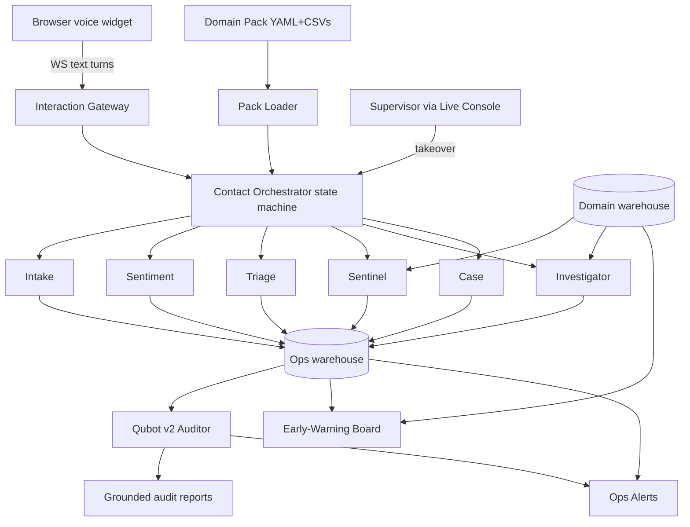
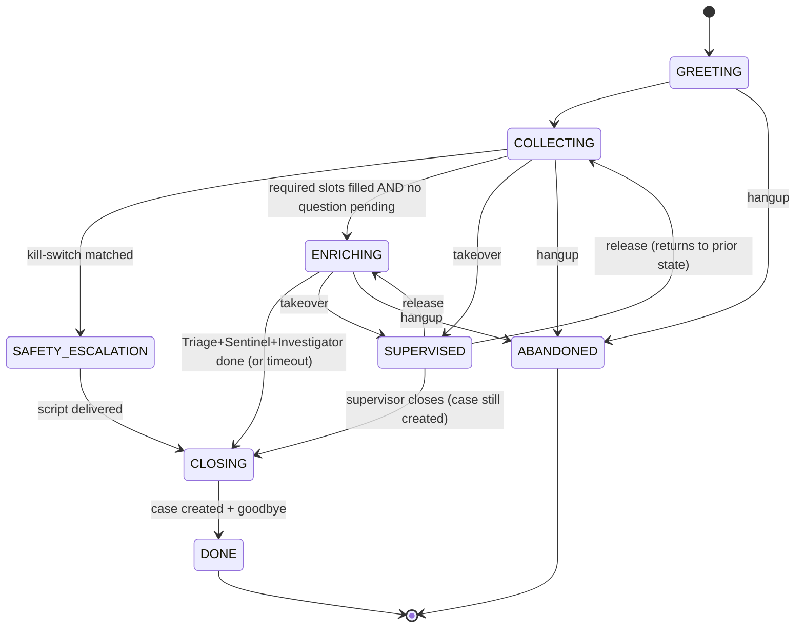

# Frontline v2 — Architecture

> The canonical architecture reference. For "how to add a vertical" see
> [Domain Pack Guide](domain_pack_guide.md). For the demo flow see
> [Demo Script](demo_script.md).

## 1. System overview

Frontline v2 is a **domain-agnostic voice-of-customer intelligence platform**.
A company plugs in a **Domain Pack** (declarative YAML + CSVs; a Pack Builder
MVP can draft one from CSV via `make pack-init`) and gets:

- an AI voice agent that answers customer contacts in the browser,
- a swarm of specialized agents that triage, check known advisories, and match
  each contact against the historical corpus while the customer is still talking,
- **Qubot v2**, the auditor, which verifies every agent action stayed grounded
  in real data and publishes executive reports,
- live early-warning analytics that re-score anomaly clusters in real time and
  auto-open named investigations,
- one-click supervisor takeover on frustration-flagged contacts,
- webhook alerts on safety escalations and risk-threshold crossings.

The agents are **generic engines**; everything domain-specific (entities, slot
questions, safety rules, advisory matching, severity logic, vocabulary) lives
in a declarative pack. Adding an industry means writing YAML + CSVs, not Python.

## 2. Architecture diagram



**Voice approach (free, demo-instant):** the browser does STT (Web Speech API)
and TTS (`speechSynthesis`); the server only sees text over a WebSocket. Zero
audio infra, zero cost. A `ChannelAdapter` interface is defined from day one so
Twilio can be added later without touching agents.

## 3. The two databases

Frontline v2 has a strict two-database contract:

### 3.1 Domain warehouse (per-pack, read-only at runtime)

Built by a seed/ingest script under `scripts/` (or the Pack Builder CLI MVP).
Shipped packs use fixture seeders. Lives at `data/domains/<pack_id>.duckdb`.
Tables:

| Table | Purpose |
|---|---|
| `records` | Historical corpus (was `complaints` in v1). Three entity slots + category + free-text. |
| `advisories` | Known issues / recalls / enforcement / notices. Scoped to entities + category. |
| `clusters` | Cluster id + top terms + record count (built by clustering). |
| `cluster_assignments` | record_id → cluster_id. |
| `weekly_anomalies` | iso_week × category × entity → z-score (rolling). |
| `backtest_results` | cluster_id × advisory_id → lead_time_weeks (the lead-time moat). |

### 3.2 Ops warehouse (platform-owned, written at runtime)

Lives at `data/frontline.duckdb`. Tables:

| Table | Purpose |
|---|---|
| `interactions` | One row per contact. Carries pack_id, pack_version, channel, status, outcome, peak_frustration, supervised. |
| `interaction_turns` | Every turn (customer/agent/supervisor) with latency_ms, llm_used, frustration_score. |
| `cases` | One row per case. Severity, priority, safety_flags, advisory_match_id, cluster_match_id, investigation_id. |
| `investigations` | Auto-opened when N cases hit the same cluster. status: open/monitoring/closed. |
| `agent_actions` | The audit ledger. Every agent side-effect. |
| `alert_dedup` | One alert per (event, ref_id) per day. |

## 4. The Domain Pack abstraction

A pack is a directory `domains/<pack_id>/`:

```
domains/automotive_nhtsa/
├── pack.yaml              # the manifest (schema-validated)
├── taxonomy.yaml          # category tree
├── gazetteers/
│   ├── makes.csv          # frequency-ranked entity values
│   ├── models.csv
│   └── categories.csv
├── context/               # Qubot context pack additions (optional)
├── playbooks/             # domain-specific Qubot playbooks (optional)
├── data/                  # mapping.yaml + ingest config (optional)
├── demo/                  # demo script + eval personas (optional)
└── models/                # trained artifacts (optional)
```

The `pack.yaml` manifest defines:
- `id`, `display_name`, `greeting`, `goodbye`, `refusal_topics`
- `entities` — labels for the three canonical entity slots (year/make/model for
  automotive; product/sub_product/company for finance)
- `slot_frame` — ordered slot list with prompt, required flag, max re-asks,
  validation strategy (gazetteer | regex | year-range | free-text)
- `safety` — escalation lexicon + safety questions + static escalation script
- `advisory_match` — parameterized SQL template over `advisories` + readback fields
- `severity` — ML artifact ref OR ordered rule list + priority matrix
- `taxonomy_ref` — category tree file

See [Domain Pack Guide](domain_pack_guide.md) for the full schema and how to
add a vertical.

## 5. The agent state machine

The orchestrator drives each contact through an explicit state machine:



**Concurrency:** enrichment agents (Sentinel, Triage, Investigator) run as asyncio
tasks while Intake keeps talking. Sentinel's entity-only advisory check can fire
as soon as entity slots fill — it doesn't wait for category/description.

**One-question-per-turn policy:** if Intake asks a question (safety or slot),
the orchestrator does NOT transition to ENRICHING until the customer answers —
preserving the one-question-per-turn contract.

## 6. The audit-first invariant

> **No ledger row, no output.**

Every agent action writes a row to `agent_actions` **before** any output is
emitted to the customer or console. This is the trust architecture's core
invariant, enforced and tested:

- The greeting is ledgered as `greeting_emitted` before TTS speaks it.
- Each slot question is ledgered as `question_asked` (by IntakeAgent) before
  the orchestrator emits it.
- The advisory notice is ledgered as `advisory_notified` (by SentinelAgent)
  before the customer hears it.
- The handoff offer is ledgered as `handoff_offer_emitted` before emission.
- The escalation script is ledgered as `escalation_script_emitted` before emission.
- Every supervisor turn is ledgered as `human_turn` (agent='supervisor')
  BEFORE it's spoken to the caller.
- The goodbye is ledgered as `goodbye_emitted` before emission.

Qubot v2's groundedness audit reads this ledger to verify every cited evidence
ID exists in the domain warehouse and matches the customer's scope.

## 7. The groundedness audit flow

When an interaction reaches DONE, the orchestrator enqueues the
`post_contact_audit` playbook (fire-and-forget; failures are ledgered but don't
surface to the customer).

For every `agent_actions` row:

1. Parse `evidence_ids` (JSON array).
2. For each evidence ID, re-query the domain warehouse to confirm it exists AND
   matches the customer's scope (advisory actually covers the customer's
   entities; record actually exists in `records`; cluster exists in `clusters`;
   investigation exists in `investigations`).
3. Run citation extraction over `output_summary` + `input_summary` to catch
   uncited IDs (e.g. an advisory ID mentioned in the text but not in
   `evidence_ids`).
4. Verdict per action: `grounded | unverifiable | mismatch`.
5. Any mismatch → report flagged red, case marked `needs_review`,
   `groundedness_mismatch` ops alert fires (deduped per interaction per day).

The audit is **deterministic code, not LLM judgment** — fully domain-agnostic
because it operates on the canonical schema.

## 8. Config knobs + env vars

| Env var | Default | Purpose |
|---|---|---|
| `DOMAIN_PACK` | `automotive_nhtsa` | Default pack when `data/active_pack.json` is absent |
| `FRONTLINE_ENABLED` | `1` | `0` → `/api/*` and `/ws/*` return 503 |
| `FRONTLINE_MAX_TURNS` | `12` | Global cap on customer turns before wrap-up |
| `FRONTLINE_ENRICH_TIMEOUT_S` | `10` | Enrichment phase timeout |
| `FRONTLINE_LLM_TURN_CAP` | `6` | Turn cap for optional LLM narration (enforced in `src/ai/provider.py`) |
| `FRONTLINE_FRUSTRATION_THRESHOLD` | `0.65` | Rolling frustration threshold for handoff |
| `FRONTLINE_INVESTIGATION_MIN_CASES` | `3` | Nth case on a cluster → auto-open investigation |
| `EARLY_WARNING_ALERT_THRESHOLD` | `0.7` | Cluster live-risk alert threshold |
| `ALERT_WEBHOOK_URL` | (empty) | Slack-compatible webhook URL |
| `CONNECTOR_ENABLED` | `0` | Outbound case/investigation connector (generic HTTP + outbox) |
| `CONNECTOR_WEBHOOK_URL` | (empty) | Optional HTTP sink for structured JSON payloads |
| `CONNECTOR_SHARED_SECRET` | (empty) | Optional `X-Connector-Secret` header on connector POSTs |
| `CLAUDE_API_KEY` | (empty) | Optional — enables LLM narration when set; spend capped |
| `OPENAI_API_KEY` | (empty) | Optional — enables LLM narration when set; spend capped |
| `MAX_DAILY_CLAUDE_COST` | `5.0` | Optional — enables LLM narration when set; spend capped |

### Enterprise Ops APIs (`/api/frontline/enterprise/*`)

Deterministic warehouse features (auth when `FRONTLINE_API_KEY` set):

| Path | Purpose |
|------|---------|
| `GET /timeline/{interaction_id}` | Interactive incident event stream |
| `GET /root-cause`, `GET /root-cause/{id}` | Failure post-mortems |
| `POST /copilot` | Supervisor intent→SQL answers |
| `GET /risk/active`, `GET /risk/{id}` | Predictive escalation scores |
| `GET /graph` | Ops knowledge graph nodes/edges |
| `GET /memory`, `GET /memory/lookup`, `POST /memory/upsert/{id}` | Cross-contact entity memory |
| `GET/POST /scenarios`, `POST /scenarios/{id}/run` | Scenario playbooks |
| `GET /decision-flow/{interaction_id}` | Agent decision DAG |
| `FRONTLINE_API_KEY` | (empty) | Single-tenant pilot secret for write routes |

## 9. Core principles (inherited from v1)

1. **DB computes; narration is deterministic today** — every number is retrieved
   from DuckDB. An optional LLM narration layer (`src/ai`) ships behind
   `FRONTLINE_LLM_ENABLED` + provider key, with turn + daily-spend caps; without
   keys, agents use deterministic templates/SQL.
2. **Cited, verifiable answers** — Qubot routes questions to pre-built
   retrievers and playbooks; every cited ID is re-verified.
3. **Audit-first agent behavior** — every agent action (including supervisor
   turns) writes a ledger row **before** the output is emitted. No ledger row,
   no output.
4. **Genericity is provable in CI** — the same eval gates must pass on both
   shipped packs. Run `make eval-frontline` to verify.

## 10. See also

- [Domain Pack Guide](domain_pack_guide.md) — how to add a vertical
- [Demo Script](demo_script.md) — the 12-beat demo, both verticals
- README.md — quick start + project layout
